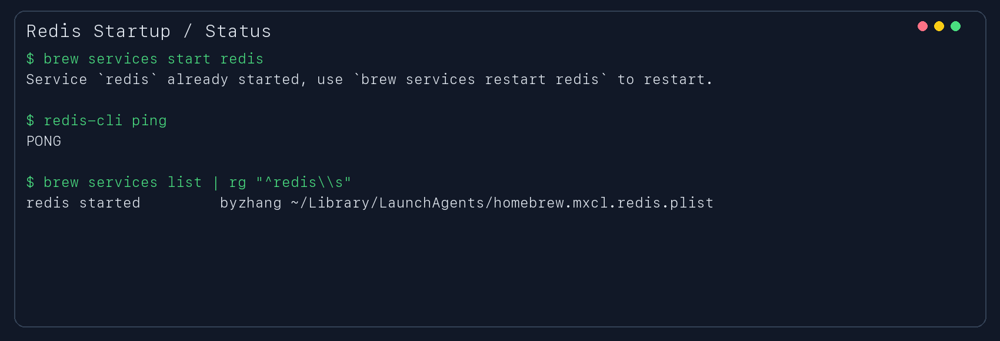
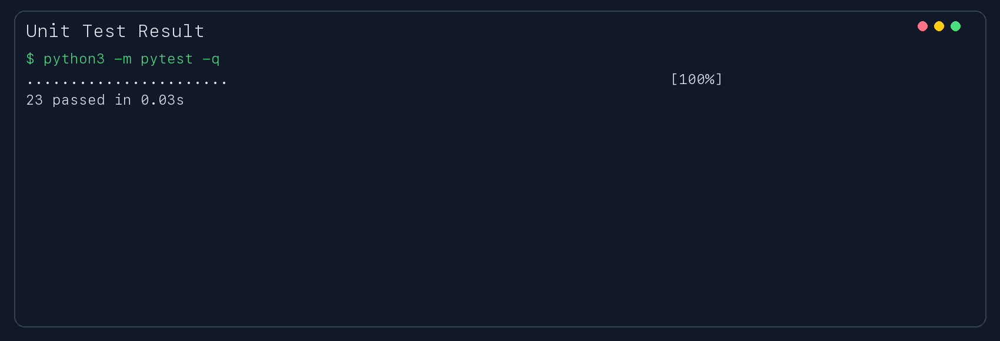
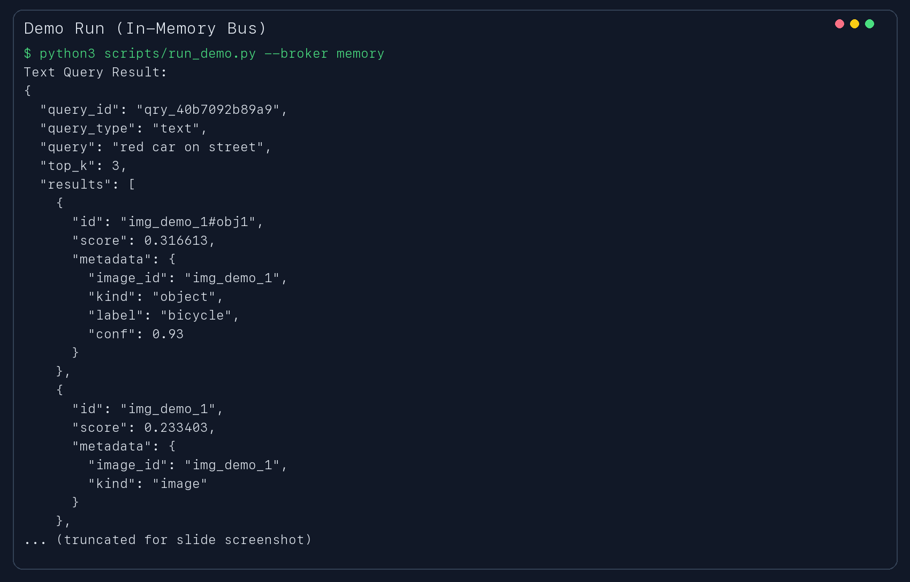
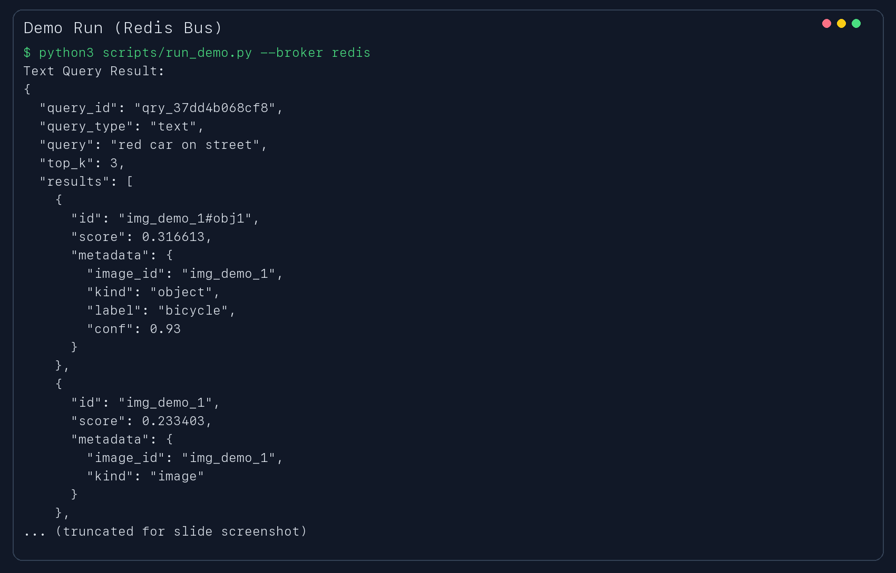

# 演示讲稿（可直接照念）

> 建议总时长：3-5 分钟  
> 你只要按下面顺序念并展示截图即可。

## 0) 开场（10 秒）

大家好，这是我的 EC530 Project 2。  
这个项目是一个事件驱动的图片标注与检索系统，重点是系统架构、可测试性和设计理由，不是训练模型。

## 1) 系统目标和边界（20 秒）

这个系统支持两类检索：  
第一，给一张图片，返回 top-k 相似图片或对象。  
第二，给一个文本主题，返回相关图片或对象。  
我没有训练新模型，也没有实现 ANN 算法，而是把重点放在服务拆分、消息流、数据归属和测试上。

## 2) 架构设计（40 秒）

我把系统拆成 7 个服务：  
Upload、Inference、DocumentDB、Embedding、VectorIndex、Query、CLI。  
事件主题包括 `image.submitted`、`inference.completed`、`annotation.stored`、`embedding.created`、`query.submitted`、`query.completed`。  
并且我遵守了单一数据归属：  
DocumentDB 只由 DocumentDBService 写入，Vector Index 只由 VectorIndexService 写入，CLI 不会绕过服务直接写数据库。

## 3) 消息契约和防御性设计（30 秒）

每个事件都遵循统一契约：  
`type`、`topic`、`event_id`、`payload`、`timestamp`。  
另外每个 topic 还有自己的必填 payload 字段校验。  
这保证了消息可测试、可复现，也方便故障注入测试。

## 4) 运行证据：Redis 已启动（展示截图 1）

现在我展示 Redis 运行状态。  
我执行了启动命令、健康检查命令和服务状态命令，结果显示 Redis 处于 started 且 ping 返回 PONG。



## 5) 运行证据：测试通过（展示截图 2）

这里是单元测试结果。  
测试覆盖了幂等性、鲁棒性、最终一致性、查询准确性，以及重复消息、丢消息、延迟、订阅方停机等场景。  
当前是 23 个测试全部通过。



## 6) 运行证据：内存总线 Demo（展示截图 3）

这张图是内存模式的端到端演示。  
可以看到文本查询会返回 top-k 结果，包含 id、score、metadata。  
这验证了完整消息链路是可运行的。



## 7) 运行证据：Redis 总线 Demo（展示截图 4）

这张图是 Redis pub-sub 模式下的端到端演示。  
结果与内存模式一致，说明系统在真实消息总线上也能正常工作。



## 8) 收尾（15 秒）

总结一下：  
这个项目满足了作业强调的事件驱动架构、消息契约、服务边界、Redis 集成和可测试性要求。  
后续我会把架构讲解视频链接补到仓库 README 的 video placeholder 位置。  
谢谢老师。

---

## 现场命令清单（你可备用）

```bash
# 1) 启动并检查 Redis
brew services start redis
redis-cli ping
brew services list | rg '^redis\\s'

# 2) 跑测试
python3 -m pytest -q

# 3) 跑 demo（内存/Redis）
python3 scripts/run_demo.py --broker memory
python3 scripts/run_demo.py --broker redis

# 4) 一键验收 + 生成截图
./scripts/check_submission.sh
python3 scripts/generate_terminal_screenshots.py
```
